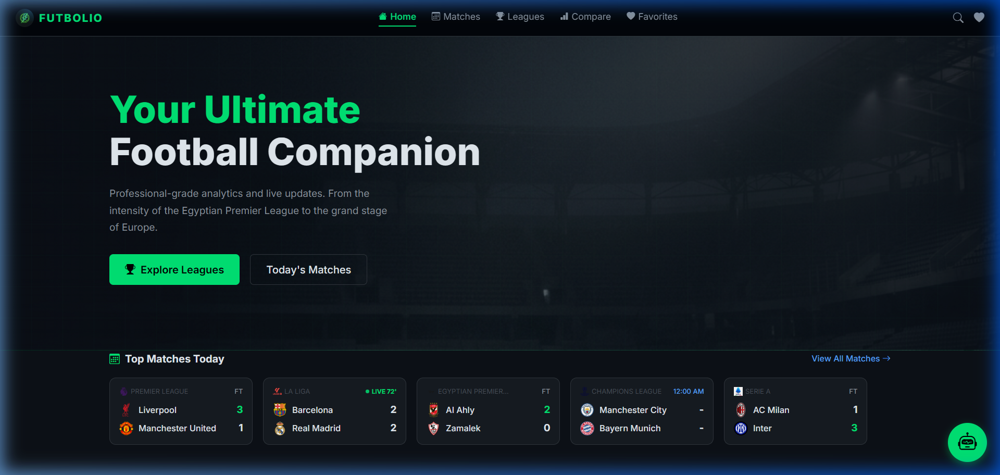
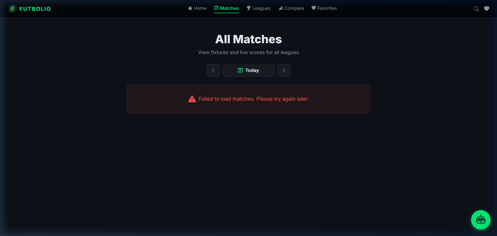
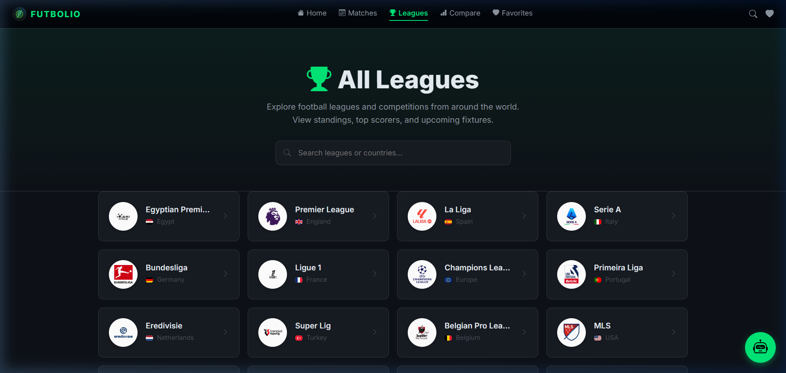
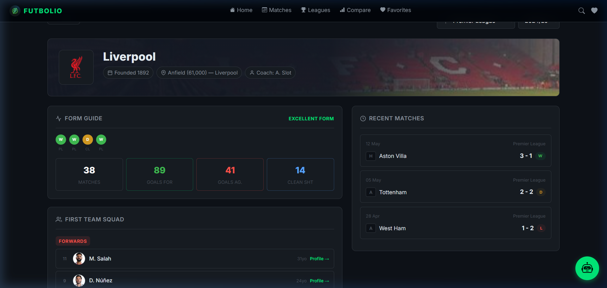
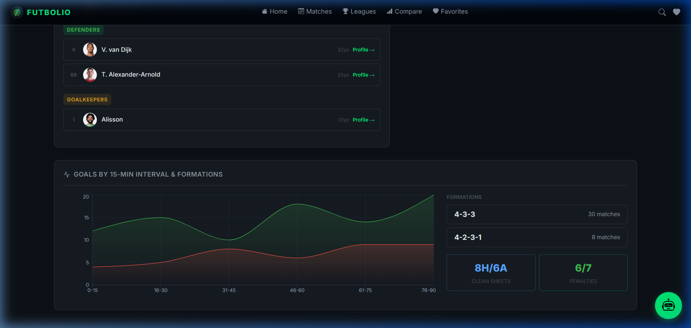
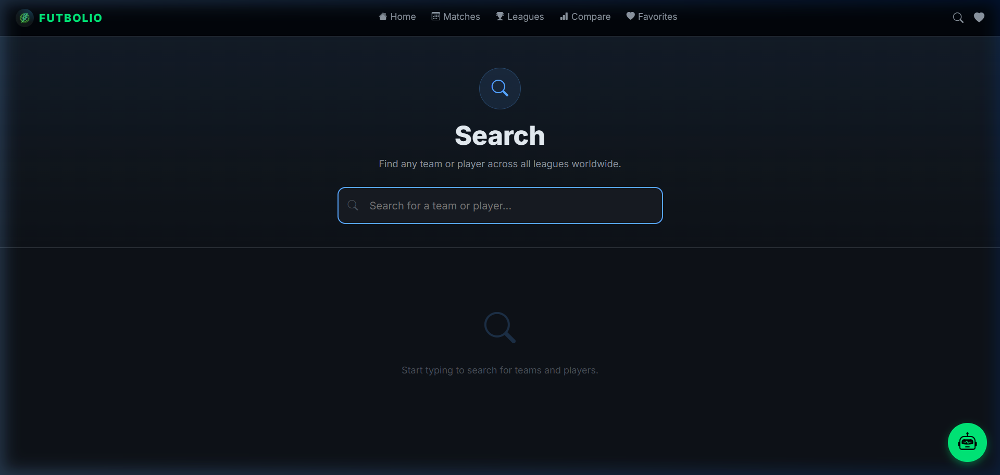
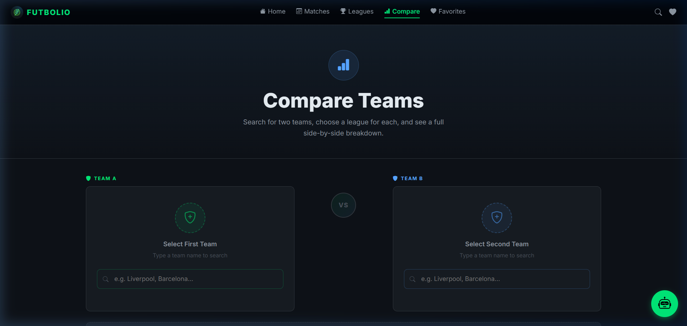
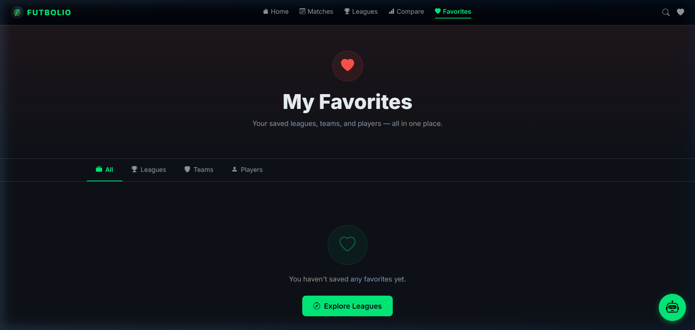

<p align="center">
  
</p>

<h1 align="center">⚽ FUTBOLIO</h1>
<h3 align="center">The Ultimate Football Experience</h3>

<p align="center">
  A modern, responsive web application for football enthusiasts — featuring live match data, in-depth statistics, interactive data visualizations, and an AI-powered chatbot.
</p>

<p align="center">
  
  
  
  
  
</p>

---

## 📋 Table of Contents

- [About The Project](#about-the-project)
- [Project Goals](#project-goals)
- [Features](#features)
- [Tech Stack](#tech-stack)
- [Screenshots](#screenshots)
- [Project Structure](#project-structure)
- [Getting Started](#getting-started)
- [Challenges & Solutions](#challenges--solutions)
- [Future Improvements](#future-improvements)
- [Team Members](#team-members)

---

## 📖 About The Project

**Futbolio** is a comprehensive football statistics web application built as a **DEPI Final Project**. It provides real-time match scores, detailed league standings, team & player profiles with advanced data visualizations, and an AI-powered chatbot that answers any football-related question instantly.

The application covers **25+ leagues** globally, including the Premier League, La Liga, Serie A, Bundesliga, Ligue 1, Champions League, and the Egyptian Premier League.

---

## 🎯 Project Goals

1. Build a **modern, responsive** single-page application (SPA) using React.
2. Integrate a **real-time football data API** for live scores and statistics.
3. Implement **interactive data visualizations** (charts, radar diagrams) for in-depth analysis.
4. Develop an **AI-powered chatbot** that answers football-related questions using the Groq API.
5. Design a **premium dark-themed UI** with smooth animations and micro-interactions.
6. Implement a **robust caching and fallback system** to handle API rate limits gracefully.

---

## ✨ Features

| Feature | Description |
|---------|-------------|
| 🏠 **Home Page** | Live match scores, featured leagues, clickable team navigation |
| 📅 **Matches Page** | Full match schedule with date picker, league filtering, live indicators |
| 📊 **Match Details** | Stats comparison, event timeline, head-to-head history, lineups |
| 🏆 **Leagues** | 25+ leagues with standings, top scorers, assists tables |
| 👕 **Team Profiles** | Team info, squad list, win/draw/loss record, goals-by-interval chart |
| 👤 **Player Profiles** | Biography, season stats, radar chart, career performance area chart |
| ⚔️ **Compare** | Side-by-side team comparison with visual stats bars |
| 🔍 **Smart Search** | Dual search for teams and players with instant results |
| ❤️ **Favorites** | Save favorite teams/players with persistent LocalStorage |
| 🤖 **Futbolio AI** | AI chatbot (Groq LLaMA 3.3 70B) — football expert, Arabic + English |
| 💾 **Caching System** | 3-layer cache with TTL-based expiry and stale fallback |
| 📱 **Responsive Design** | Fully responsive across desktop, tablet, and mobile |

---

## 🛠️ Tech Stack

| Category | Technology |
|----------|-----------|
| **Frontend** | React 19, Vite 8 |
| **Routing** | React Router v7 |
| **HTTP Client** | Axios |
| **Football API** | API-Sports (api-football.com) |
| **AI Chatbot** | Groq Cloud API (LLaMA 3.3 70B Versatile) |
| **Data Visualization** | Recharts (Radar, Area, Bar charts) |
| **Styling** | Custom CSS, Bootstrap Grid, CSS Variables |
| **State Management** | React Context API |
| **Caching** | LocalStorage with TTL-based expiry |
| **Build Tool** | Vite (ESBuild, HMR) |

---

## 📸 Screenshots

### Home Page


### Matches Page


### Leagues Page


### Team Profile


### Data Visualization (Charts)


### Search Page


### Compare Page


### Favorites Page


---

## 📁 Project Structure

```
football_stats/
├── public/
│   ├── futbolio-logo.png          # App logo
│   └── logos/                     # League logos
├── src/
│   ├── components/
│   │   ├── Chatbot.jsx            # AI chatbot (Groq integration)
│   │   ├── Navbar.jsx             # Navigation bar
│   │   ├── Footer.jsx             # Footer component
│   │   ├── Loader.jsx             # Loading spinner
│   │   └── cards/
│   │       ├── PlayerCard.jsx     # Player result card
│   │       └── TeamCard.jsx       # Team result card
│   ├── pages/
│   │   ├── HomePage.jsx           # Main landing page
│   │   ├── MatchesPage.jsx        # All matches by date
│   │   ├── MatchDetailsPage.jsx   # Single match details
│   │   ├── LeaguesListPage.jsx    # Leagues grid
│   │   ├── LeaguePage.jsx         # League standings & stats
│   │   ├── TeamPage.jsx           # Team profile & charts
│   │   ├── PlayerPage.jsx         # Player profile & charts
│   │   ├── ComparePage.jsx        # Team comparison
│   │   ├── SearchPage.jsx         # Search teams/players
│   │   └── FavoritesPage.jsx      # Saved favorites
│   ├── services/
│   │   ├── apiService.js          # Axios instance + cache logic
│   │   ├── cacheService.js        # LocalStorage cache with TTL
│   │   └── footballApiService.js  # All API endpoint methods
│   ├── context/
│   │   └── FavoritesContext.jsx   # Favorites state management
│   ├── constants/
│   │   └── leagues.js             # League configurations (25+)
│   ├── App.jsx                    # Root component with routing
│   ├── main.jsx                   # App entry point
│   ├── index.css                  # Global styles & CSS variables
│   └── profile.css                # Team/Player profile styles
├── screenshots/                   # Project screenshots
├── .env                           # Environment variables (API keys)
├── package.json                   # Dependencies
└── README.md                      # This file
```

---

## 🚀 Getting Started

### Prerequisites

- **Node.js** (v18 or higher)
- **npm** (v9 or higher)

### Installation

1. **Clone the repository**
   ```bash
   git clone https://github.com/ItcProjects-R4/GHR4_SWD2_S1_PROJECT2.git
   cd GHR4_SWD2_S1_PROJECT2
   ```

2. **Install dependencies**
   ```bash
   npm install
   ```

3. **Set up environment variables**
   
   Create a `.env` file in the root directory:
   ```env
   VITE_API_FOOTBALL_KEY=your_api_football_key
   VITE_API_BASE_URL=https://v3.football.api-sports.io
   VITE_CACHE_TTL_MINUTES=15
   VITE_GROQ_API_KEY=your_groq_api_key
   ```
   
   - Get your Football API key from [api-football.com](https://www.api-football.com/)
   - Get your Groq API key from [console.groq.com](https://console.groq.com/keys)

4. **Run the development server**
   ```bash
   npm run dev
   ```

5. **Open in browser**
   ```
   http://localhost:5173
   ```

---

## 🧩 Challenges & Solutions

### 1. API Rate Limits & Account Suspension
- **Problem:** The API-Sports free tier has strict rate limits (100 requests/day). Our account was suspended multiple times during development.
- **Solution:** Implemented a **3-layer fallback system**:
  1. Fresh Cache (LocalStorage with 15-min TTL)
  2. Live API Call (if cache expired)
  3. Stale Cache Fallback (returns old data if API fails)
  4. Static Demo Data (hardcoded fallback as last resort)

### 2. Integrating Team Member's Standalone Codebase
- **Problem:** A team member developed TeamProfile and PlayerProfile as standalone components with their own API layer and CSS, causing conflicts.
- **Solution:** Refactored their API calls to use our central `ApiService`, created isolated `profile.css`, and added demo data fallbacks.

---

## 🔮 Future Improvements

- [ ] **User Authentication** — Login/signup with Firebase for personalized experience
- [ ] **Push Notifications** — Real-time alerts for live match goals and results
- [ ] **Dark/Light Mode Toggle** — Theme switcher for user preference
- [ ] **Progressive Web App (PWA)** — Offline support and installability
- [ ] **Social Features** — Match predictions, comments, and sharing
- [ ] **Advanced Analytics** — xG (Expected Goals), heat maps, and pass networks
- [ ] **Multi-language Support** — Full Arabic localization
- [ ] **Deployment** — Host on Vercel/Netlify with CI/CD pipeline

---

## 👥 Team Members

| Name | Role |
|------|------|
| **Omar Lokma** | Lead Developer |
| **Essam Hany** | Developer |
| **Yousef Amer** | Developer |
| **Basmala Shalaby** | Developer |

**Track:** Frontend using ReactJs  
**Program:** DEPI (Digital Egypt Pioneers Initiative)

---

## 📄 License

This project is licensed under the MIT License.

---

<p align="center">
  Made with ❤️ by the Futbolio Team — DEPI Round 4
</p>
